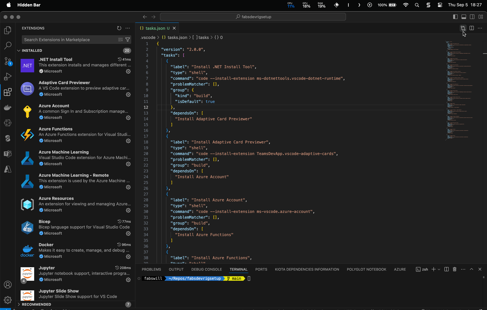

# Fabs Dev Rig Setup

This repository demonstrates how to automate the installation of Visual Studio Code extensions using VS Code tasks. The setup is designed to streamline the process and can be extended over time to include new extensions or automation steps.

## Table of Contents
- [Introduction](#introduction)
- [Video Demo](#video-demo)
- [Current Extensions](#current-extensions)
- [Setup Instructions](#setup-instructions)
- [Screenshots](#screenshots)
- [Future Plans](#future-plans)
- [Contributing](#contributing)
- [License](#license)

## Introduction
In this repository, we use Visual Studio Code tasks to automatically install several key extensions required for development environments, including tools for .NET, Azure, and Docker. This setup is easy to extend for additional extensions or more complex automation tasks.

## Video Demo
Watch the one-minute video below to see the extension installation tasks in action:

### Screenshot


### Watch the Demo Video
[Watch the demo video](media/extensionsmovie1m.mp4)

## Current Extensions
Here is the list of extensions currently being installed automatically:
1. .NET Install Tool (`ms-dotnettools.vscode-dotnet-runtime`)
2. Adaptive Card Previewer (`TeamsDevApp.vscode-adaptive-cards`)
3. Azure Account (`ms-vscode.azure-account`)
4. Azure Functions (`ms-azuretools.vscode-azurefunctions`)
5. Azure Machine Learning (`ms-toolsai.vscode-ai`)
6. Azure Machine Learning - Remote (`ms-toolsai.vscode-ai-remote`)
7. Azure Resources (`ms-azuretools.vscode-azureresourcegroups`)
8. Teams Toolkit (`TeamsDevApp.ms-teams-vscode-extension`)
9. Semantic Kernel Tools (`ms-semantic-kernel.semantic-kernel`)
10. YAML (`redhat.vscode-yaml`)
11. Prettier - Code Formatter (`esbenp.prettier-vscode`)
12. Polyglot Notebooks (`ms-dotnettools.dotnet-interactive-vscode`)
13. Microsoft Kiota (`ms-graph.kiota`)
14. Docker (`ms-azuretools.vscode-docker`)
15. Bicep (`ms-azuretools.vscode-bicep`)

## Setup Instructions

### Step 1: Clone the Repository
```bash
git clone https://github.com/yourusername/fabsdevrigsetup.git
cd fabsdevrigsetup